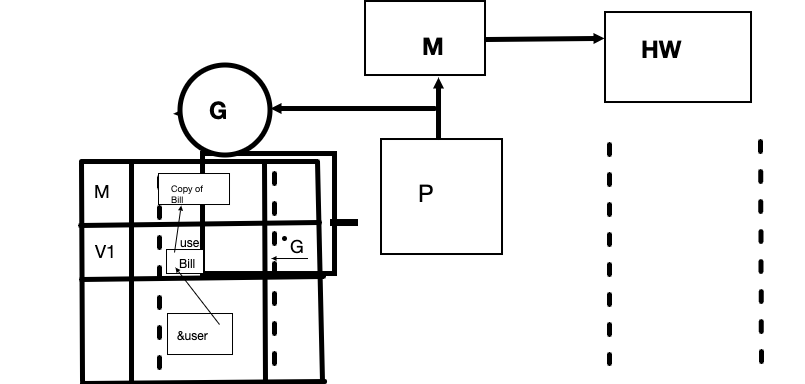
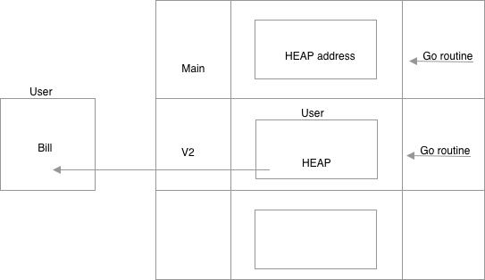

# Ultimate Go

## Memory and Data Semantics
> 💡 _Semantics_ refers to **behavior** of a thing.

### Variables
> Type is life!

Type represents a few things
1. The amount of memory that we are reading and writing
2. What the data represents

Without those 2 things there is no integrity

The basic unit of memory is a **bit** and `1 bit == 8 bytes`. Without knowledge of the type we just have an arbitrary number of bits.

Remember to be sympathetically aware of the architecture.

`var` **should be used with a zero value construction**. All that we are really getting at here is if the value is zero, just declare that variable with a `var`.

Strings represents a two-"word" value.
> 💡 **Word** in this instance represents a **generic** allocation. So in the case of the playground we are talking about a 4 byte allocation, and likewise on my machine this would represent an 8 byte allocation because my machine is 64 bits. This could represent either an integer or an address.

The worst word is `nil` is a pointer and the second word is in the case of a empty string is 0.

**Conversion over casting**
We could have a 1 byte integer that we decide that it should be a 4 byte integer. Instead of casting that integer we convert the int to 4 bytes by adding those additional 3 bytes.

> 🛎️  wrap up:
>
> 1. Go has its types, and it loves them.
>
> 2. We have many ways to declare variables in Go.
>
> 3. For the sake of integrity, although conversion exists with the `unsafe` package you should not use it unless you have a very explicit reason which almost never exists.

### Struct Types
Go has 3 types of built-in types:
1. Strings
2. Numerics
3. Bool

And then we have our user defined types of:
1. Struct
2. Reference

**Struct types allow you the engineer to define the data**.
> "Implicit conversion of types is the Halloween special of coding. Whoever thought if them deserves their own special kind of hell"
>
> \- Martin Thompson

**Type represents 2 things**:
1. The size of memory that we are allocating
2. What the data represents.

**When we reference composite types we mean that it is made up of existing types**

**Mechanical Sympathy**

Part of this process is is called which is called alignment. Padding is applied during our memory allocation which just allows us to not have to spill over machine word boundary. 2 byte operation falls in a 2 byte value, 4 byte value falls in a 4 byte alignment, etc etc.....

> consider `function` as a non-named type variable

### Pointers
Pass by value is referring to making a copy of data.

When your Go programs starts it looks to how many logical processors/cores we have. Go does this by looking at how many physical cores and processors you have. This boils down to 2 hardware threads per physical core. In my case that means I have 12. Hardware threads are what we use to operate the operating system. You can run 1 goroutine per hardware thread and 2 hardware threads per physical core and 4 physical cores per processor.

The runtime creates a `P` which is a logical processor and that is connected to an `M` which is an operating system thread which scheduled by the OS on the Hardware thread. We also have a `GoRoutine` which is equivalent to the `M`. the operating system threads job is to execute instructions sequentially one after and another.

Every Go program gets a contiguous block of memory called a stack that starts at 2K. Operating Systems differ on the os side.

When the code starts we start on the runtime. Every time that `main()` is executed consider this a crossing over the program boundary where we get a slice of memory. Every function is a data transformation.

In the case of a variable when ask for it value by typing the name of the variable it does what you might think and the question we ask with the variable name is, **What is the value?**. In go we can use an `&` in front where the variable which denotes address. So we are asking, **Where is the value stored**. This will give us a memory location.

`Value = what's in the box`

`Address = where is the box`

`Data = value && address`

### Sharing Data - Pointer Semantics
`*` is how we assign a pointer to a variable. Remember that it the `GoRoutine` only has direct access to memory inside its current frame. The `*` gives indirect access to the variables' value which is a address.

**2 Semantics in Go**:
1. Value: Your copy of the data.
2. Pointer: Added efficiency in a shared access to data

While the stack is self cleaning, the heap is not.